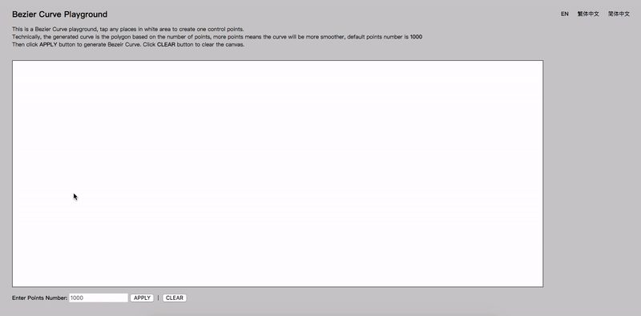

# Bezier Curve Playground
<a href="http://www.wtfpl.net/"></a>

The Playground of Bezier Curve



## How to play with it?
```bash
    > git clone https://github.com/ZixiaoWang/BezierCurvePlayground.git
    > open index.html
```

## Why am I writting this?
For fun of course. The original requirement came from one of the projects which I was involved, the requirement was about to draw a 4th-order Bezier Curve, and the curve will be used as moving trace for something. So I was think maybe I was able to make a function to draw whatever-order Bezier Curve.  
So I spent a few hours and made a page like this. Apparently I was inspired by many excellent demo pages and tutorials. But it is a good practice, at least for me. 

## Lisence
```txt
        DO WHAT THE FUCK YOU WANT TO PUBLIC LICENSE 
                    Version 2, December 2004 

 Copyright (C) 2004 Sam Hocevar <sam@hocevar.net> 

 Everyone is permitted to copy and distribute verbatim or modified 
 copies of this license document, and changing it is allowed as long 
 as the name is changed. 

            DO WHAT THE FUCK YOU WANT TO PUBLIC LICENSE 
   TERMS AND CONDITIONS FOR COPYING, DISTRIBUTION AND MODIFICATION 

  0. You just DO WHAT THE FUCK YOU WANT TO.
```